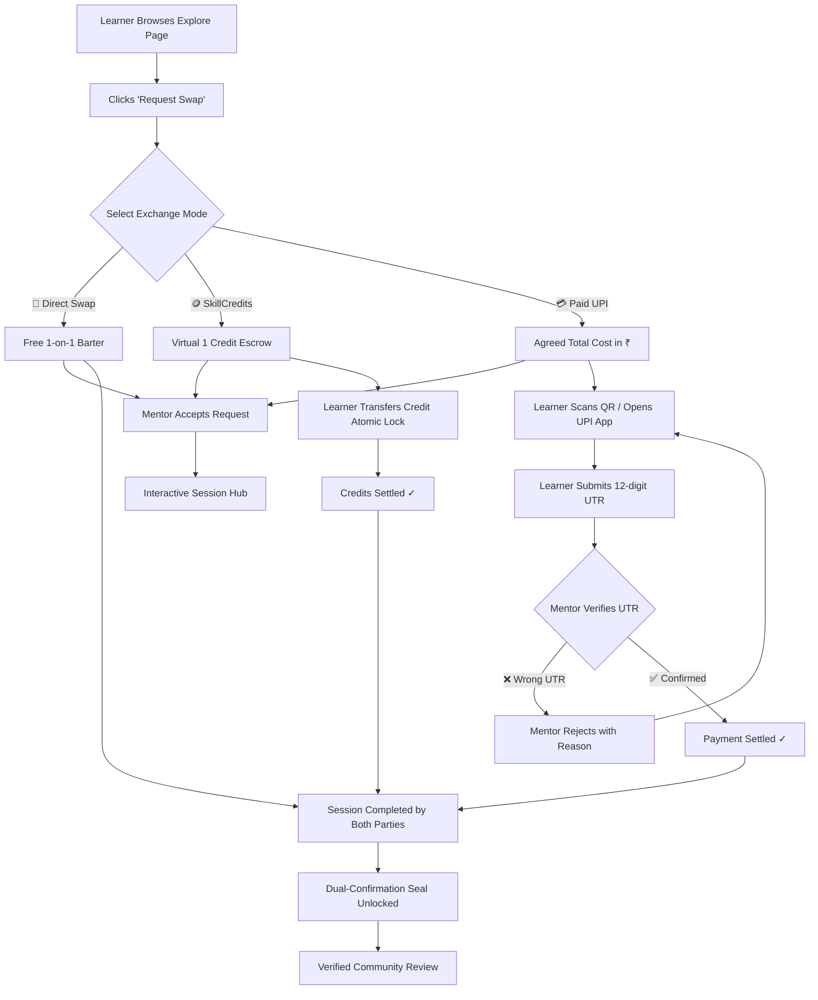

<div align="center">

# ⚡ SkillSwap

### *The Modern Hybrid-Economy Peer-to-Peer Skill Exchange Platform*

**Learn, Teach, Swap, and Earn — Free Barter, Virtual Time-Banking, or Zero-Commission Direct UPI Payments.**

---

[](https://reactjs.org/)
[](https://nodejs.org/)
[](https://www.mongodb.com/)
[](https://socket.io/)
[](LICENSE)

[🌐 Live Deployment](#-production-deployment) • [✨ Core Features](#-core-features) • [🪙 Hybrid Economy](#-the-hybrid-exchange-economy) • [🏗 Architecture](#-system-architecture) • [🔌 API Reference](#-api-endpoints-reference) • [🚀 Quick Start](#-getting-started)

</div>

---

## 📖 Table of Contents

- [🌟 About The Project](#-about-the-project)
- [✨ Core Features](#-core-features)
- [🪙 The Hybrid Exchange Economy](#-the-hybrid-exchange-economy)
- [🏗 System Architecture](#-system-architecture)
- [💬 WebSocket Real-Time Communication](#-websocket-real-time-communication)
- [🤖 Interactive FAQ Assistant (Chatbot)](#-interactive-faq-assistant-chatbot)
- [🛠 Tech Stack & Tools](#-tech-stack--tools)
- [📊 Database Schema Design](#-database-schema-design)
- [🔌 API Endpoints Reference](#-api-endpoints-reference)
- [🚀 Getting Started](#-getting-started)
- [🔐 Environment Variables](#-environment-variables)
- [🌐 Production Deployment](#-production-deployment)
- [🤝 Contributing & License](#-contributing--license)

---

## 🌟 About The Project

**SkillSwap** is a community-driven web application designed to remove barriers to learning and mentorship. Rather than restricting users to a single exchange model, SkillSwap introduces a **Hybrid Exchange Economy**:

1. **Direct Barter**: Trade skills 1-on-1 for free (e.g., teach Guitar in exchange for Web Development).
2. **SkillCredits (Time-Banking)**: Earn and spend virtual credits. Every new user receives **5 free credits** on registration.
3. **Direct UPI (₹) Payments**: Mentors set a reference base rate and receive direct, zero-platform-fee payments via GPay, PhonePe, Paytm, or BHIM.

The platform guarantees trust through **dual-confirmation completion seals**, **locked settlement gates**, **UTR dispute workflows**, and **verified peer reviews**.

---

## ✨ Core Features

### 🔄 1. Hybrid Exchange Modes
- **3-Way Flexible Requests**: Choose between Direct Swap (free), SkillCredits (1 credit), or Custom UPI Amount (₹).
- **Custom Negotiated Pricing**: Mentors display a base rate as a reference, while learners can propose a total project/course cost.

### 🛡️ 2. Trust & Dual-Confirmation Engine
- **Dual Confirmation**: Both learner and mentor must mark the session complete for it to close.
- **Payment Settlement Gate**: Completion is programmatically locked until payment is verified or SkillCredits are transferred.
- **UTR Verification & Rejection**: Learners submit their 12-digit UPI UTR reference; mentors can verify or reject with custom feedback.
- **Verified Reviews**: Only genuine participants with completed sessions can submit 1–5 star ratings and reviews.

### 💬 3. WebSocket Real-Time Chat & Session Workspace
- **Instant Peer-to-Peer Chat**: Room-based WebSockets powered by Socket.io.
- **Live Typing Indicators**: Real-time visual feedback when the other user is typing.
- **Dynamic Session Hub**: Displays agreed terms, payment QR code, transaction status, and completion progress.

### 🪙 4. Virtual Time-Banking Ledger & Wallet
- **Double-Entry Ledger**: Full transaction history tracking incoming and outgoing credits and UPI payments.
- **Global Wallet Modal**: Accessible across the entire app with a live balance chip in the navigation bar.
- **Atomic Operations**: Protected against race conditions using MongoDB `$inc` and conditional locks.

### 🤖 5. Guided Assistant & FAQ Bot
- **Categorized Decision-Tree Bot**: Instant guidance on platform rules, swapping, credit system, safety, and contacts.
- **Click-Outside Auto-Dismissal**: Minimizes cleanly when interacting with the main workspace.

### 🎨 6. Premium Glassmorphic UI/UX
- **Dark & Light Mode**: Seamless theme switching with high-contrast, tailored color palettes.
- **Framer Motion Animations**: Smooth page transitions, modal spring physics, and interactive seals.

---

## 🪙 The Hybrid Exchange Economy



---

## 🏗 System Architecture

```text
┌─────────────────────────────────────────────────────────────────────────┐
│                              CLIENT (Vite + React 18)                   │
│                                                                         │
│   Pages: Landing • Explore • Dashboard • Session Hub • Profile         │
│   Contexts: AuthContext • ThemeContext                                 │
│   Components: WalletModal (Portal) • PaymentSettlementCard • ChatBot    │
│   Networking: Centralized API Helper (api.js) • Socket.io-client        │
└───────────────────┬─────────────────────────────────┬───────────────────┘
                    │ REST API (Axios)                │ WebSockets (Socket.io)
                    ▼                                 ▼
┌─────────────────────────────────────────────────────────────────────────┐
│                             SERVER (Node.js + Express)                  │
│                                                                         │
│   Middleware: JWT Auth Guard • CORS Policy • Error Handler              │
│   Controllers: Auth • Skills • Requests • Payments • Messages • Reviews │
│   Socket Server: Room Join • Peer-to-Peer Chat • Live Typing Broadcast │
└─────────────────────────────────────┬───────────────────────────────────┘
                                      │ Mongoose ODM
                                      ▼
┌─────────────────────────────────────────────────────────────────────────┐
│                             DATABASE (MongoDB Atlas)                    │
│                                                                         │
│   Collections: Users • Skills • Requests • Transactions • Reviews       │
└─────────────────────────────────────────────────────────────────────────┘
```

---

## 💬 WebSocket Real-Time Communication

SkillSwap uses **Socket.io** for low-latency peer-to-peer session interactions:

| Event Name | Direction | Payload | Description |
| :--- | :--- | :--- | :--- |
| `join_room` | Client ➔ Server | `requestId` | User enters private session room |
| `send_message` | Client ➔ Server | `{ requestId, senderId, text }` | Sends message and persists to database |
| `receive_message`| Server ➔ Client | `Message Document` | Broadcasts new message to room members |
| `typing` | Client ➔ Server | `{ requestId, senderId, isTyping }` | Emits user typing status |
| `user_typing` | Server ➔ Client | `{ senderId, isTyping }` | Renders animated typing pulse |

---

## 🤖 Interactive FAQ Assistant (Chatbot)

The floating Chatbot (`client/src/components/ChatBot.jsx`) provides instant answers to common platform questions without requiring an external AI API key:

- **Categories**: SkillSwap Basics, Courses & Mentorship, SkillCredits Rules, Payment Safety, Contact Support.
- **Interactive Decision Tree**: Users click topics to drill down to specific questions and answers.
- **UX Features**: Auto-scroll to latest response, animated entry/exit, click-outside auto-collapse.

---

## 🛠 Tech Stack & Tools

### **Frontend**
- **Framework**: React 18 with Vite
- **Routing**: React Router DOM v6
- **Styling**: Vanilla CSS Design Tokens (Custom Glassmorphism, CSS Modules)
- **Animations**: Framer Motion
- **Icons**: Lucide React
- **HTTP Client**: Axios
- **Real-Time Client**: Socket.io-client

### **Backend**
- **Runtime**: Node.js
- **Web Framework**: Express.js
- **Database**: MongoDB with Mongoose ODM
- **Authentication**: JWT (JSON Web Tokens) & Bcrypt.js
- **Real-Time Engine**: Socket.io
- **File Uploads**: Cloudinary & Multer

---

## 📊 Database Schema Design

### 1. `User` Schema
- `name`, `email`, `password`
- `avatar`, `bio`, `location`
- `skillsOffered`, `skillsWanted`
- `upiId` *(String)*: Mentor's UPI VPA address
- `hourlyRate` *(Number)*: Base reference rate in ₹
- `skillCredits` *(Number, default: 5)*: Virtual credit balance
- `rating`, `reviewsCount`

### 2. `Request` Schema
- `sender` (Learner) & `receiver` (Mentor)
- `skill` (Ref to Skill)
- `status`: `['Pending', 'Accepted', 'Rejected', 'Completed']`
- `exchangeType`: `['SkillSwap', 'SkillCredits', 'PaidUPI']`
- `agreedAmount` *(Number)*: Total agreed ₹ or Credits
- `paymentStatus`: `['NotRequired', 'Pending', 'Settling', 'PaidByStudent', 'Settled']`
- `paymentDetails`: `{ upiId, utrNumber, paidAt, rejectionNote }`
- `completedBy`: Array of user IDs who confirmed completion

### 3. `Transaction` Schema (Ledger)
- `fromUser` & `toUser`
- `request` (Ref to Request)
- `type`: `['SkillCredit', 'UPI_Payment']`
- `amount` *(Number)*
- `status`: `['Pending', 'Completed', 'Verified', 'Disputed']`
- `utrNumber`, `paidAt`, `verifiedAt`, `note`

---

## 🔌 API Endpoints Reference

### 🔐 Authentication (`/api/auth`)
| Method | Endpoint | Description | Auth |
| :--- | :--- | :--- | :--- |
| `POST` | `/register` | Register new account (awards 5 credits) | ❌ |
| `POST` | `/login` | Authenticate user & receive JWT token | ❌ |
| `GET` | `/me` | Get current logged-in user profile | ✅ |
| `PUT` | `/profile` | Update profile, bio, UPI ID, and base rate | ✅ |

### 📚 Skills (`/api/skills`)
| Method | Endpoint | Description | Auth |
| :--- | :--- | :--- | :--- |
| `GET` | `/` | Get all skills (supports search, category, location) | ❌ |
| `GET` | `/my` | Get skills created by current user | ✅ |
| `POST` | `/` | Create a new skill listing | ✅ |
| `DELETE`| `/:id` | Delete a skill listing | ✅ |

### 🤝 Requests & Sessions (`/api/requests`)
| Method | Endpoint | Description | Auth |
| :--- | :--- | :--- | :--- |
| `POST` | `/` | Send swap request with exchangeType & amount | ✅ |
| `GET` | `/` | Get user's incoming and outgoing requests | ✅ |
| `GET` | `/:id` | Get request and session details by ID | ✅ |
| `PUT` | `/:id` | Accept or reject a swap request | ✅ |
| `POST` | `/:id/complete` | Dual-confirmation mark complete handler | ✅ |

### 💳 Payments & Wallet (`/api/payments` & `/api/wallet`)
| Method | Endpoint | Description | Auth |
| :--- | :--- | :--- | :--- |
| `GET` | `/wallet/balance`| Get balance and last 20 ledger transactions | ✅ |
| `POST` | `/payments/submit-utr` | Learner submits 12-digit UPI UTR | ✅ |
| `POST` | `/payments/confirm-receipt` | Mentor verifies and settles payment | ✅ |
| `POST` | `/payments/reject-utr` | Mentor rejects invalid UTR with reason | ✅ |
| `POST` | `/payments/settle-credits` | Atomic SkillCredit transfer lock | ✅ |

---

## 🚀 Getting Started

### Prerequisites
- **Node.js** v18.0.0 or higher
- **npm** or **yarn**
- **MongoDB** instance (Local or Atlas)

### 1. Clone the repository
```bash
git clone https://github.com/kaushik-53/SkillSwap.git
cd SkillSwap
```

### 2. Configure & Start Backend
```bash
cd server
npm install
```

Create `.env` in `server/`:
```env
PORT=5000
NODE_ENV=development
MONGO_URI=mongodb+srv://<username>:<password>@cluster.mongodb.net/skillswap?retryWrites=true&w=majority
JWT_SECRET=your_super_secret_jwt_key
CLIENT_URL=http://localhost:5173
```

Run server:
```bash
npm run dev
```

### 3. Configure & Start Frontend
```bash
cd ../client
npm install
```

Create `.env` in `client/`:
```env
VITE_API_URL=http://localhost:5000
```

Run client:
```bash
npm run dev
```

Open your browser at **`http://localhost:5173`**.

---

## 🔐 Environment Variables

### Backend (`server/.env`)
| Variable | Required | Description |
| :--- | :---: | :--- |
| `PORT` | ❌ | Server port (default: 5000) |
| `NODE_ENV` | ❌ | Environment mode (`development` / `production`) |
| `MONGO_URI` | ✅ | MongoDB connection string |
| `JWT_SECRET` | ✅ | Secret key for JWT signing |
| `CLIENT_URL` | ✅ | Allowed frontend origin for CORS and WebSockets |
| `CLOUDINARY_*` | ❌ | Cloudinary credentials for permanent avatar storage |

### Frontend (`client/.env`)
| Variable | Required | Description |
| :--- | :---: | :--- |
| `VITE_API_URL` | ✅ | Base URL of the backend API (e.g. `http://localhost:5000` or production URL) |

---

## 🌐 Production Deployment

### 1. Backend on [Render](https://render.com)
1. Create a new **Web Service** connected to your repository.
2. Set **Root Directory**: `server`
3. Set **Build Command**: `npm install`
4. Set **Start Command**: `npm start`
5. Add Environment Variables: `MONGO_URI`, `JWT_SECRET`, `CLIENT_URL` *(your Vercel URL)*.

### 2. Frontend on [Vercel](https://vercel.com)
1. Import the Git repository in Vercel.
2. Set **Root Directory**: `client`
3. Set **Build Command**: `npm run build`
4. Set **Output Directory**: `dist`
5. Add Environment Variable:
   - `VITE_API_URL` = `https://<your-render-app>.onrender.com`

---

## 🤝 Contributing & License

Contributions are always welcome!
1. Fork the repo.
2. Create your feature branch (`git checkout -b feature/NewFeature`).
3. Commit your changes (`git commit -m 'Add NewFeature'`).
4. Push to the branch (`git push origin feature/NewFeature`).
5. Open a Pull Request.

Distributed under the **MIT License**. See `LICENSE` for more details.

---

<div align="center">

Made with ❤️ for collaborative learning by the **SkillSwap Community**

</div>