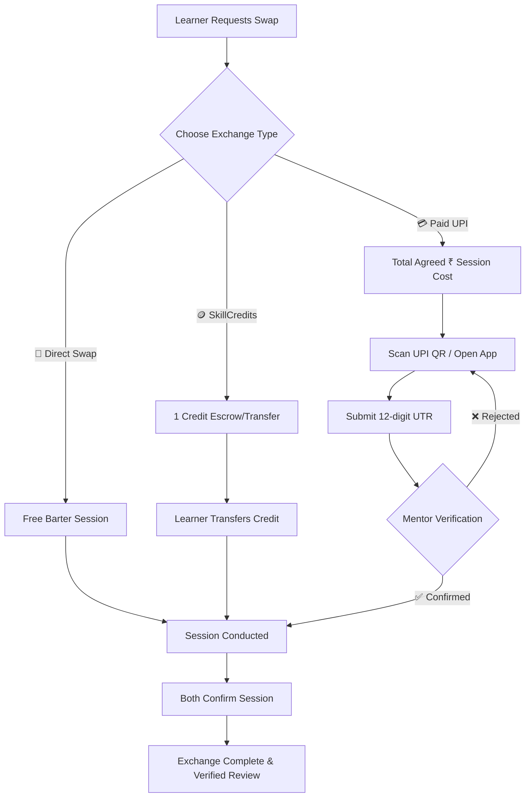

<div align="center">

# ⚡ SkillSwap

**A Next-Gen Peer-to-Peer Skill Exchange & Hybrid Economy Platform**

*Swap skills directly, spend virtual SkillCredits, or pay mentors via zero-commission UPI — all in one modern, glassmorphic platform.*

[](https://reactjs.org/)
[](https://nodejs.org/)
[](https://www.mongodb.com/)
[](https://socket.io/)
[](LICENSE)

[Live Demo](#-live-deployment) • [Key Features](#-key-features) • [Economy Models](#-hybrid-exchange-economy) • [Tech Stack](#-tech-stack) • [Getting Started](#-getting-started) • [Environment Variables](#-environment-variables)

---

</div>

## 🌟 Overview

**SkillSwap** empowers individuals, students, and professionals to exchange knowledge friction-free. Whether you want to barter a guitar lesson for web development, pay with virtual **SkillCredits**, or hire a mentor directly with **UPI (₹)**, SkillSwap provides a verified, dual-confirmed environment with real-time chat, instant QR payments, and automated audit ledgers.

---

## ✨ Key Features

### 🔄 1. Hybrid Exchange Economy (3 Ways to Swap)
* **Direct Barter (Free)**: Mutual 1-to-1 skill exchange with zero money or credits required.
* **SkillCredits (Time-Banking)**: Every user starts with **5 free credits**. Spend 1 credit to learn from a mentor, or earn credits by teaching others.
* **Direct UPI (₹) Payments**: Mentors can showcase a reference base rate and receive direct payments via Google Pay, PhonePe, Paytm, or BHIM with zero platform fee.

### 🛡️ 2. Dual-Confirmation & Trust Engine
* **Dual-Confirmation Seals**: Sessions complete only when **both** parties verify the exchange.
* **Locked Settlement Gate**: Completion is protected until payment is verified or credits are transferred.
* **UTR Verification & Dispute Handling**: Learners submit their 12-digit UPI UTR reference; mentors can verify or reject invalid UTRs with custom reasons.
* **Verified Reviews**: Only authentic swap participants can submit ratings and reviews.

### 💬 3. Real-Time Chat & Session Hub
* Built-in peer-to-peer WebSocket messaging with live typing indicators.
* Dedicated session workspace featuring agreed terms, status tracking, and inline review forms.

### 🤖 4. Interactive Guided Assistant (FAQ Bot)
* Predefined decision-tree chatbot providing instant answers on how swaps work, credit rules, payment safety, and troubleshooting.
* Click-outside auto-dismissal and smooth categorized navigation.

### 🎨 5. Modern Glassmorphic Design System
* Rich dark/light theme switching with smooth transitions.
* Framer Motion micro-animations, exchange seals, and responsive layouts for mobile and desktop.
* Global wallet modal with balance overview and real-time transaction ledger.

---

## 🪙 Hybrid Exchange Economy



---

## 🛠 Tech Stack

### **Frontend**
* **Core**: React 18, Vite
* **Styling**: Vanilla CSS Design Tokens, Glassmorphism, CSS Modules
* **Animations**: Framer Motion
* **Icons & Assets**: Lucide React
* **Networking**: Axios, Socket.io-client

### **Backend**
* **Runtime**: Node.js, Express.js
* **Database**: MongoDB Atlas via Mongoose ODM
* **Authentication**: JWT (JSON Web Tokens), Bcrypt.js, OTP verification
* **Real-Time**: Socket.io
* **Media & Cloud**: Cloudinary, Multer

---

## 🚀 Getting Started

### Prerequisites
* [Node.js](https://nodejs.org/) (v18+ recommended)
* [MongoDB](https://www.mongodb.com/) (Local or MongoDB Atlas cluster)
* [Git](https://git-scm.com/)

---

### 1. Clone the Repository
```bash
git clone https://github.com/kaushik-53/SkillSwap.git
cd SkillSwap
```

### 2. Configure Backend
```bash
cd server
npm install
```
Create a `.env` file in the `server/` directory:
```env
PORT=5000
NODE_ENV=development
MONGO_URI=your_mongodb_connection_string
JWT_SECRET=your_jwt_secret_key
CLIENT_URL=http://localhost:5173

# Optional: Cloudinary for user profile avatar uploads
CLOUDINARY_CLOUD_NAME=your_cloud_name
CLOUDINARY_API_KEY=your_api_key
CLOUDINARY_API_SECRET=your_api_secret

# Optional: SMTP / Email service for OTPs
EMAIL_USER=your_email@gmail.com
EMAIL_PASS=your_email_app_password
```

Start the backend server:
```bash
npm run dev
```

---

### 3. Configure Frontend
```bash
cd ../client
npm install
```
Create a `.env` file in the `client/` directory:
```env
VITE_API_URL=http://localhost:5000
```

Start the frontend Vite dev server:
```bash
npm run dev
```

Visit **`http://localhost:5173`** in your browser.

---

## 🔐 Environment Variables

| Variable | Location | Description |
| :--- | :--- | :--- |
| `MONGO_URI` | `server/.env` | MongoDB connection URI string |
| `JWT_SECRET` | `server/.env` | Secret key for signing authentication tokens |
| `CLIENT_URL` | `server/.env` | Allowed origin for CORS & Socket.io (e.g. `https://your-app.vercel.app`) |
| `VITE_API_URL` | `client/.env` | Backend API base URL (e.g. `https://your-api.onrender.com`) |
| `CLOUDINARY_*` | `server/.env` | *(Optional)* Cloudinary credentials for avatar uploads |

---

## 🌐 Production Deployment

This project is architected for split cloud deployment:

* **Frontend**: Deploy on **[Vercel](https://vercel.com)** or **[Netlify](https://netlify.com)**
  * *Root Directory*: `client`
  * *Build Command*: `npm run build`
  * *Output Directory*: `dist`
  * *Environment Variable*: `VITE_API_URL=https://<your-backend-service>.onrender.com`

* **Backend**: Deploy on **[Render](https://render.com)** or **[Railway](https://railway.app)**
  * *Root Directory*: `server`
  * *Build Command*: `npm install`
  * *Start Command*: `npm start`
  * *Environment Variable*: `CLIENT_URL=https://<your-frontend>.vercel.app`

---

## 📂 Project Structure

```text
SkillSwap/
├── client/                     # Frontend (React + Vite)
│   ├── src/
│   │   ├── components/         # Modals, Navbar, Chatbot, Wallet & Settlement Cards
│   │   │   ├── ui/             # GlassCard, Buttons, Status Badges, Seals
│   │   │   ├── ChatBot.jsx     # Interactive FAQ & Assistant
│   │   │   ├── PaymentSettlementCard.jsx # QR & Settlement flow
│   │   │   ├── WalletModal.jsx # Ledger & SkillCredits balance
│   │   │   └── ...
│   │   ├── context/            # AuthContext, ThemeContext
│   │   ├── pages/              # Landing, Explore, Dashboard, Session, Profile
│   │   ├── utils/              # API helpers, image helpers
│   │   └── App.jsx
│   └── package.json
│
├── server/                     # Backend (Node.js + Express)
│   ├── config/                 # Database configuration
│   ├── controllers/            # Auth, Skills, Requests, Payments, Messages
│   ├── middleware/             # Auth JWT protection
│   ├── models/                 # User, Skill, Request, Transaction, Review
│   ├── routes/                 # API route definitions
│   └── index.js                # Server entry point & Socket.io handler
│
└── README.md
```

---

## 🤝 Contributing

Contributions, issues, and feature requests are welcome!
1. Fork the Project
2. Create your Feature Branch (`git checkout -b feature/AmazingFeature`)
3. Commit your Changes (`git commit -m 'Add some AmazingFeature'`)
4. Push to the Branch (`git push origin feature/AmazingFeature`)
5. Open a Pull Request

---

## 📜 License

Distributed under the MIT License. See `LICENSE` for more information.

<div align="center">
Made with ❤️ by the <b>SkillSwap Community</b>
</div>