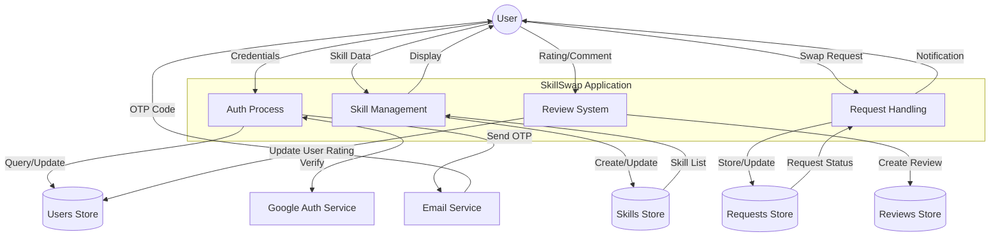
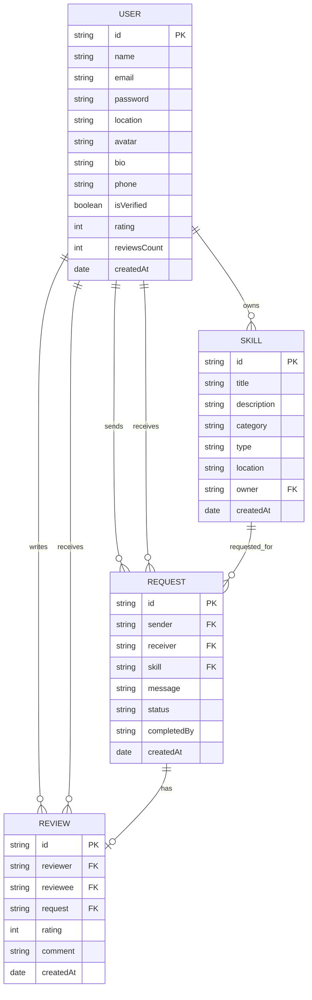

# ABSTRACT

In the modern digital landscape, the acquisition of specialized skills is often constrained by high financial costs and the impersonal nature of global learning platforms. This project presents **SkillSwap**, a premium, non-monetary peer-to-peer (P2P) platform designed to facilitate the exchange of expertise within local communities using a "gift economy" model. Built on the high-performance **MERN stack** (MongoDB, Express, React, Node.js), SkillSwap enables users to trade their talents—ranging from technical coding to artisanal crafts—without the exchange of money, thereby fostering community resilience and lifelong learning.

The system addresses the critical "trust gap" inherent in P2P marketplaces through a multi-layered security framework, incorporating **Google OAuth** for frictionless onboarding, **Resend** email infrastructure for secure OTP-based verification, and a proprietary **Dual-Confirmation** swap lifecycle. This ensures that every exchange is validated by both parties before conclusion. Furthermore, a "Requester-Only" review system prevents reputational fraud and maintains high standards of accountability. By leveraging cloud-native technologies such as **MongoDB Atlas** for data management and **Cloudinary** for media optimization, the application provides a scalable, responsive, and visually stunning (Glassmorphic) user experience.

The implementation follows an **Agile development methodology**, ensuring iterative refinement of core modules. The final product successfully demonstrates that a trust-based, decentralized social ledger can effectively replace monetary capital in the pursuit of knowledge. Future enhancements including AI-based matching and native mobile integration will further scale the platform's ability to foster mutual aid and sustainable community growth.

---

# Chapter I: INTRODUCTION

## 1.1 Overview
In the contemporary digital era, the value of skills and knowledge has surpassed traditional forms of capital. As the global economy becomes increasingly specialized, the ability to acquire new competencies is no longer just an advantage but a necessity for personal and professional growth. However, the traditional pathways to learning—formal education, professional certifications, and paid workshops—often come with significant financial and geographical hurdles. **SkillSwap** is a revolutionary, premium, and community-driven web application designed to bridge this gap by reinventing how we value and exchange human expertise.

The core philosophy of SkillSwap is rooted in the concept of a "Gift Economy" and "Collaborative Consumption." In a world dominated by monetary transactions, SkillSwap proposes a decentralized platform where neighbors and community members can exchange their expertise directly with one another—entirely without the involvement of money. This paradigm shift encourages a more sustainable and inclusive form of societal development, where every individual's unique talent is recognized as a valid form of currency.

Whether it is a software engineer offering a coding tutorial in exchange for a yoga session, or a master gardener sharing planting tips for a home-cooked meal, SkillSwap provides the digital infrastructure to facilitate these human-centric interactions. The platform is built using the high-performance MERN (MongoDB, Express, React, Node.js) stack, ensuring a seamless, secure, and visually stunning user experience that rivals premium global marketplaces. By focusing on local communities, SkillSwap doesn't just transfer skills; it rebuilds the social fabric that often wears thin in the isolation of the digital age.

## 1.2 Problem Statement
Despite the proliferation of massive open online courses (MOOCs) and social media platforms, the current landscape of skill sharing is fragmented and exclusionary. Several critical issues persist in existing models:

1. **The Financial Threshold:** Standard professional skill-sharing platforms (like MasterClass or LinkedIn Learning) require high subscription fees or per-session payments. This creates a "knowledge divide," where only those with disposable income can afford to diversify their skill sets.
2. **The Trust Deficit in P2P Exchanges:** Finding a reliable mentor or a dedicated student in a general social media environment (like Facebook Groups or Craigslist) is fraught with risk. The absence of identity verification and structured feedback mechanisms often leads to poor-quality exchanges or, in worst cases, security concerns.
3. **The Isolation of Global Platforms:** Existing global platforms are transactional and impersonal. They facilitate the transfer of information but do not foster the "neighborly" touch. This lack of community context means that once a transaction is over, no lasting social connection is formed.
4. **Undervaluing Non-Professional Skills:** High-value technical skills are often prioritized over "hobbyist," "lifestyle," or "manual" skills in existing marketplaces because the latter are harder to monetize. This leaves a vast reservoir of human knowledge (like artisanal crafts, gardening, or life coaching) untapped.
5. **Inefficient Matching and Discovery:** Users often struggle to find exactly what they need within their immediate vicinity. General-purpose search engines are not optimized for the specific "Offers" and "Wants" structure of a skill exchange.

SkillSwap is designed specifically to dismantle these barriers by providing a structured, secure, and cost-free environment where trust is the primary currency.

## 1.3 Objective of Project
The primary objective of this project is to research, design, and develop a robust, secure, and user-centric web application that enables community members to exchange skills efficiently. To achieve this, several specific objectives were identified:

- **Developing a Secure and Multi-Layered Authentication System:** Implementing email-based OTP verification (utilizing the Resend service), JWT-based session management, and Google OAuth integration to ensure that every participant is verified and their data is protected.
- **Designing a Transparent and Accountable Workflow:** Creating a proprietary "Dual-Confirmation" system. Unlike traditional e-commerce, where a transaction ends at payment, a SkillSwap session only concludes when both the provider and the receiver mark the task as completed, ensuring high standards of service.
- **Building a Trust-Based Reputation Engine:** Developing a "Requester-Only" review system. By restricting review capabilities to the individual who requested the skill, the platform prevents "review farming" and ensures that feedback is authentic and based on actual experience.
- **Optimizing Discovery and Matching:** Building an intuitive dashboard and exploration system that allows users to filter skills by categories (Tech, Creative, Lifestyle, etc.) and location, making the discovery of local talent effortless.
- **Implementing a Premium and Responsive UI:** Utilizing modern design principles like "Glassmorphism" and libraries like Framer Motion to create an interface that is not only functional but also emotionally engaging and "WOWs" the user.
- **Ensuring High Availability and Scalability:** Leveraging cloud-native technologies like MongoDB Atlas for data and Cloudinary for media storage to provide a fast and reliable experience regardless of the user's location.

## 1.4 Applications or Scope
The scope of SkillSwap extends beyond a simple "app" and into the realm of social infrastructure. Its applications are diverse and far-reaching:

- **Empowering Local Neighborhoods:** Connecting residents in a way that fosters mutual aid and resilience. In times of economic hardship, the ability to trade services (like plumbing for tutoring) can be a vital survival tool.
- **Student and Campus Life:** Allowing students to trade academic expertise for creative skills (e.g., "Math for Guitar Lessons"), helping them balance their education with personal interests without increasing their student debt.
- **Professional Cross-Training:** Enabling professionals to explore new career paths through informal mentorship. A marketing manager might trade strategy advice for basic web development lessons.
- **Lifelong Learning for All Ages:** Providing a platform for retirees and seniors—who possess decades of unrecorded wisdom—to share their life's work with younger generations, bridging the generational gap.
- **Crisis Management and Community Support:** In localized emergencies, SkillSwap can be used to quickly identify and mobilize individuals with specific skills (e.g., first aid, childcare, or manual labor).

The development scope encompasses the full software development lifecycle (SDLC), from initial requirement gathering and architectural diagramming to the implementation of the MERN backend, the React frontend, and final deployment on cloud platforms.

## 1.5 Organization of Report
This report is meticulously structured to provide a comprehensive look at the development journey and the technical architecture of SkillSwap:

- **Chapter II (Literature Survey):** Explores the history of barter systems, the rise of the "Sharing Economy," and an analysis of current market leaders to identify existing gaps.
- **Chapter III (Methodology):** The heart of the report, detailing the Agile development process, the tech stack (including Resend for emails), and system-wide diagrams (Use Case, DFD, ERD).
- **Chapter IV (System Requirements):** Lists the specific hardware and software prerequisites required to build, host, and run the application.
- **Chapter V (Expected Outcomes):** Showcases the final product through detailed descriptions of the GUI and the expected user experience across core modules.
- **Chapter VI (Conclusion & Future Scope):** Summarizes the project's impact and outlines a roadmap for future AI-driven and mobile-first enhancements.
- **Chapter VII (References):** Provides a curated list of academic papers, technical documentation, and influential texts used as the foundation for this work.

---
 Linda

# Chapter II: LITERATURE SURVEY

The concept of skill sharing and non-monetary exchange is not a new phenomenon; rather, it is a digital renaissance of ancient social practices. However, its digital implementation has evolved significantly over the last two decades as technology has enabled trust-building at a scale previously unimaginable. A comprehensive literature survey of this field reveals a shift from global, centralized learning platforms toward more localized, peer-to-peer (P2P) systems that prioritize community trust, accessibility, and the "democratization of knowledge."

## 2.1 Historical Context: The Barter System and Gift Economies
Anthropological studies, most notably those by Marcel Mauss and David Graeber, suggest that early human societies did not rely on the simple "myth of barter" as often depicted in economic textbooks. Instead, they functioned primarily through **Gift Economies**. In a gift economy, goods and services are given without an explicit agreement for immediate or future rewards; instead, social obligations and community status drive the exchange. This "cycle of reciprocity"—the obligation to give, the obligation to receive, and the obligation to repay—formed the bedrock of communal stability.

The barter system, while more transactional, also relied on the "double coincidence of wants," which was historically difficult to achieve in small-group settings without some form of social ledger. In the digital age, these concepts have been reimagined through the lens of **Collaborative Consumption**. This theoretical framework, popularized by Rachel Botsman, suggests that technology allows for the "rebirth of community" by enabling people to share, swap, and rent assets (including time and skills) rather than owning them. SkillSwap is a direct digital implementation of these ancient social ledgers, providing the structure needed to scale reciprocity beyond immediate family or friend circles.

## 2.2 Analysis of Existing Platforms
To understand the niche that SkillSwap occupies, it is essential to analyze the strengths and weaknesses of current market leaders in the learning and community sectors.

### 2.2.1 Professional Learning Platforms (Coursera, Udemy, LinkedIn Learning)
The last decade saw the rise of the MOOC (Massive Open Online Course) movement. These platforms have undeniably democratized access to high-quality education from world-class universities and industry experts. However, they are fundamentally different from SkillSwap in several critical ways:
- **Monetization and Entry Barriers:** They are primarily for-profit entities. While they offer some free content, true certification and advanced learning always require financial investment, which maintains a barrier for lower-income users.
- **One-Way Pedagogy:** Education on these platforms is primarily top-down (instructor to massive audience). This lacks the interactive, tailored feedback of a one-on-one session.
- **Asynchronous Isolation:** Users typically consume pre-recorded content in isolation, missing the social and networking benefits of community-based learning.

### 2.2.2 The "Gig Economy" Platforms (Upwork, Fiverr, TaskRabbit)
While these platforms facilitate peer-to-peer interactions, they are optimized for monetary extraction. This leads to a "race to the bottom" where experts are commoditized, and the focus is on the lowest price rather than the highest quality of human connection. The "transactional" nature of these sites often discourages mentorship and favors quick delivery over mutual growth.

### 2.2.3 Community-Based Skill Sharing (TimeBanks and Local Exchange Trading Systems - LETS)
TimeBanks are the direct ideological ancestors of SkillSwap. In a TimeBank, one hour of work equals one "time credit," regardless of the type of work performed. While noble in intent, many TimeBank implementations have struggled due to:
- **Technological Debt:** Most existing TimeBank softwares feature outdated, non-responsive user interfaces that fail to engage the modern user.
- **Verification Issues:** They often lack robust, automated identity verification, relying instead on manual vetting by community organizers.
- **Status Stagnation:** Without a dynamic "live" discovery system, listings often become stale, leading to user frustration.

## 2.3 Gaps in Existing Solutions: The Case for SkillSwap
A synthesis of current research into digital marketplaces identifies three primary "structural gaps" that SkillSwap is specifically designed to fill:

1. **The Trust-Scalability Paradox:** Small communities have high trust but low variety in skills. Global platforms have high variety but low trust. SkillSwap aims for the "Goldilocks Zone" by using technology (OTP, Google Auth, Dual-Confirmation) to scale trust within local communities.
2. **The Convenience-Social Gap:** Facebook Groups and Nextdoor facilitate local posts, but they are "noisy" and lack a structured lifecycle. There is no easy way to track a request from initial contact to the final review in a non-transactional environment.
3. **The Reciprocity Imbalance:** Purely social platforms often suffer from "lurkers"—users who take but do not give. By creating a visible portfolio of "Offers" and "Wants," SkillSwap encourages a balanced ecosystem of contribution.

## 2.4 Theoretical Framework: Trust-Centered Design (TCD)
SkillSwap is built upon the **Trust-Centered Design (TCD)** framework. This framework posits that in decentralized, non-monetary marketplaces, trust is not just a feature; it is the primary currency. TCD focuses on:
- **Reputational Portability:** Allowing users to build a "social resume" that they can carry with them, verified by actual peers.
- **State-Based Accountability:** Using clear, visible "Session States" (Requested -> Accepted -> Completed -> Reviewed) to guide users through the exchange and ensure that both parties fulfill their commitments.
- **Frictionless Onboarding:** Reducing the cognitive load for new users through intuitive UI and Google integrated sign-ins, while maintaining high security standards.

By bridging these gaps, SkillSwap aims to create a sustainable, high-trust environment for lifelong learning and community development.

---

# Chapter III: METHODOLOGY

The development of SkillSwap followed a formal **Agile Software Development Lifecycle (SDLC)**. This iterative approach was selected due to the complex, state-driven nature of peer-to-peer exchanges, where requirements often evolve as user behavior is observed. Agile methodology allowed for the decomposition of the project into manageable "Sprints," focusing on delivering a Minimum Viable Product (MVP) first and then layering on premium features like Cloudinary integration and Google OAuth.

Central to this methodology was the use of the **MERN (MongoDB, Express, React, Node.js) Stack**. This full-stack JavaScript environment was chosen for several technical reasons:
- **Unified Language:** Using JavaScript/JSX across both the client and server reduced the cognitive overhead and allowed for the sharing of validation logic and data structures.
- **JSON Dominance:** MongoDB’s BSON format aligns perfectly with JavaScript objects, eliminating the need for complex Object-Relational Mapping (ORM) and allowing for a flexible, schema-less approach to skill listings.
- **Non-Blocking I/O:** Node.js’s asynchronous nature is ideal for a platform that handles frequent, small-scale I/O operations like notifications and session updates.

SkillSwap leverages a "Best-in-Class" selection of modern platforms and services to ensure a premium user experience and industrial-grade reliability.

### 3.2.1 Core Frameworks
- **React 18 & Vite:** The frontend utilizes React's component-based architecture to manage a complex UI state. Vite was chosen as the build tool for its lightning-fast Hot Module Replacement (HMR) and optimized production builds.
- **Express.js & Node.js:** The backend is a RESTful API built on Express, providing a robust routing system and middleware support for authentication and error handling.

### 3.2.2 Data and Media Management
- **MongoDB Atlas:** A multi-cloud database service that ensures our non-relational data is highly available and automatically backed up.
- **Cloudinary:** To solve the problem of persistent image storage (especially when using ephemeral hosting like Render), Cloudinary was integrated. It handles the uploading, resizing, and delivery of user avatars and skill-related images through a global Content Delivery Network (CDN).

### 3.2.3 Secure Communication (Email via Resend)
A critical component of the SkillSwap methodology is the **Verification Loop**. To ensure that every user is a real person, the system implements an OTP (One-Time Password) system.
- **The Choice of Resend:** Traditional SMTP services are often slow and suffer from poor deliverability. SkillSwap integrates **Resend**, a developer-first email infrastructure. Resend was selected for its:
    - **High Delivery Rates:** Ensuring that verification OTPs reach the user's inbox within seconds.
    - **Clean API:** Providing a modern, promise-based SDK that integrates seamlessly with Node.js.
    - **Reliability:** Detailed logging and analytics for tracking email delivery success.

The project was executed in five rigorous phases to ensure quality and completeness:

1. **Requirement Analysis and Wireframing:** Defining the core "User Stories"—e.g., "As a user, I want to confirm a swap so that I can leave a review." Wireframes were designed with a focus on a "Desktop-First, Mobile-Responsive" layout.
2. **Schema Design and API Modeling:** Designing the four core entities: Users, Skills, Requests, and Reviews. API endpoints were modeled using REST principles to ensure predictability.
3. **Core Module Implementation:** Developing the authentication system and the skill discovery engine. This phase included the integration of JWT (JSON Web Tokens) for stateless session management.
4. **Interactive Lifecycle Development:** Implementing the "Swap Session" logic. This required careful handling of database states (e.g., ensuring a request can only move to 'Accepted' if it's currently 'Pending').
5. **Testing, Optimization, and Deployment:** Conducted comprehensive "Manual Smoke Testing" of all user flows. The application was then deployed using a split-architecture: Vercel for the React frontend and Render for the Node.js backend.

The SkillSwap application is organized into several modular components:

### 3.4.1 Authentication and Identity Module
This is the gateway to the SkillSwap ecosystem. It utilizes a hybrid approach to security:
- **Local Auth:** Users can register with an email. The system triggers an OTP flow via **Resend**, ensuring the email is valid before account activation.
- **Google OAuth:** For users seeking a frictionless experience, Google One-Tap is integrated, allowing for "1-Click" onboarding.
- **Security:** Passwords are never stored in plain text; they are hashed using **bcryptjs** with a high salt-round count.

### 3.4.2 Skill Discovery and Management Module
Allows users to become "Contributors" to the community.
- **Listings:** Users can create detailed skill cards with titles, categories, and swap types.
- **Discovery Engine:** A highly optimized search and filter system that allows users to find expertise based on category tags or location strings.
- **Media Handling:** All listing images are processed via Multer and uploaded directly to Cloudinary, ensuring the frontend stays lightweight.

### 3.4.3 Swap Lifecycle and Confirmation Module
The "Engine" of the platform that handles the actual exchange between two humans.
- **State Machine Architecture:** A swap request moves through a defined state machine: `Pending -> Accepted/Rejected -> Completed -> Finalized`.
- **Dual-Confirmation Logic:** To prevent disputes, a session only reaches the `Completed` state when both the sender and the receiver have clicked the verification button. This ensures mutual satisfaction before the session is closed.

### 3.4.4 Social Proof and Review Module
Building the infrastructure of trust.
- **Weighted Ratings:** User ratings are dynamically calculated based on the average of all reviews received.
- **Requester Exclusivity:** To maintain the highest integrity, the code enforces a rule where only the requester of a skill (the "purchaser") can leave a review. This mirrors real-world marketplace dynamics and prevents "reciprocity bias" in ratings.

## 3.5 Diagrams (ER, Use Case, DFD)

### 3.5.1 Use Case Diagram (Functional Interaction)
The Use Case diagram below illustrates the primary interactions between the different actors (Guests and Registered Users) and the core system functionalities. It highlights the bridge between manual user actions and the automated system services like Google Auth and **Resend (for OTP delivery)**. This visualization provides a high-level view of how SkillSwap manages user entry points and the skill-sharing lifecycle.

```mermaid
useCaseDiagram
    actor "Guest" as G
    actor "Registered User" as U
    actor "Google Auth" as GA <<System>>
    actor "Email Service" as ES <<System>>

    package "SkillSwap System" {
        usecase "Register/Login" as UC1
        usecase "Google Sign-In" as UC2
        usecase "Verify Email (OTP)" as UC3
        usecase "Update Profile" as UC4
        usecase "List a New Skill" as UC5
        usecase "Browse/Search Skills" as UC6
        usecase "Send Swap Request" as UC7
        usecase "Manage Requests (Accept/Reject)" as UC8
        usecase "Mark Task Completed" as UC9
        usecase "Post Review" as UC10
    }

    G --> UC1
    G --> UC2
    G --> UC6
    
    U --> UC3
    U --> UC4
    U --> UC5
    U --> UC6
    U --> UC7
    U --> UC8
    U --> UC9
    U --> UC10

    UC2 -- GA
    UC3 -- ES
```

### 3.5.2 Data Flow Diagram (Level 1)
The Level 1 Data Flow Diagram (DFD) focuses on the transformation of data as it moves from the User Interface through the Backend Processes and into the Persistent storage. It specifically details the flow of credentials for authentication (including the **Resend verification loop**) and the multi-step lifecycle of swap requests. This diagram serves as the blueprint for our RESTful architecture.



### 3.5.3 Entity Relationship Diagram (ERD)
The Entity Relationship Diagram (ERD) details the logical data model representing the entities—Users, Skills, Requests, and Reviews—and their complex relationships within the SkillSwap database. This schema design is optimized for a NoSQL environment (MongoDB), prioritizing rapid read/write operations for skill exploration while maintaining the integrity of the peer-to-peer swap history.



---

# Chapter IV: SYSTEM REQUIREMENTS

To ensure the smooth development and deployment of the SkillSwap application, a specific set of hardware and software requirements must be met. These requirements ensure that the system is scalable, secure, and provides a low-latency experience for users.

## 4.1 Software Requirements
The software environment for SkillSwap is centered around the JavaScript ecosystem, utilizing tools that prioritize developer productivity and runtime efficiency.

- **Operating System:** Windows 10/11, macOS (Latest), or Linux (Ubuntu 20.04+).
- **Runtime Environment:** Node.js (v18.0.0 or higher) - The core engine for the backend and development tooling.
- **Package Manager:** NPM (v9.0.0+) or Yarn - For managing dependencies.
- **Backend Framework:** Express.js (v5.0+) - For building the REST API.
- **Frontend Library:** React (v18+) - For building the user interface.
- **Database:** MongoDB Atlas (Cloud Edition) - For data storage.
- **Version Control:** Git & GitHub - For collaborative development and hosting the source code.
- **Development Tools:** Visual Studio Code (VS Code) with extensions for ESLint, Prettier, and Tailwind CSS.
- **Web Browser:** Modern browsers such as Google Chrome (v100+), Mozilla Firefox, or Microsoft Edge.
- **API Testing:** Postman or Insomnia - For validating backend endpoints.
- **Email Delivery Service:** **Resend** - For critical system communications (OTPs, notifications).
- **Hosting Platforms:** Vercel (Frontend) and Render (Backend).

## 4.2 Hardware Requirements
The hardware specifications are designed to support both the development environment and the end-user's device capabilities.

### 4.2.1 Development Hardware
- **Processor:** Quad-core CPU (Intel i5/i7 or AMD Ryzen 5/7) or better.
- **RAM:** Minimum 8GB (16GB recommended for concurrent frontend and backend development).
- **Storage:** 256GB SSD (Solid State Drive) for fast file access and build times.
- **Internet:** High-speed broadband connection for cloud database access and deployment.

### 4.2.2 End-User Hardware
- **Device:** Desktop, Laptop, or Tablet (Responsive design supports various screen sizes).
- **Processor:** Any modern dual-core processor.
- **RAM:** Minimum 2GB.
- **Screen Resolution:** Minimum 1024x768 (Optimal: 1920x1080).

---

# Chapter V: EXPECTED OUTCOMES (with GUI)

The SkillSwap application is expected to deliver a premium, high-fidelity experience that transforms the way neighbors interact. This chapter describes the key user interfaces and the expected behavior of the system.

## 5.1 The SkillSwap Aesthetic
The platform utilizes a **Modern Glassmorphic Design System**. This includes:
- **Depth and Layering:** Sublte box shadows and semi-transparent backgrounds to create a sense of hierarchy.
- **Vibrant Gradients:** Soft, multi-colored gradients that prevent the UI from feeling static.
- **Micro-Animations:** Smooth transitions using Framer Motion when navigating between pages or interacting with buttons.

## 5.2 Key User Interfaces (GUI)

### 5.2.1 Landing Page & Navigation
The landing page provides a clear value proposition: "Exchange skills, not money." It features a modern sticky navigation bar and a hero section with abstract, friendly illustrations created to feel welcoming.

- **Expected Outcome:** Users should immediately understand the platform's purpose and be able to navigate to "Explore" or "Login" within seconds.

### 5.2.3 Skill Discovery Page
The exploration page features a grid-based layout of "Skill Cards." Each card displays the skill title, category (e.g., Tech, Lifestyle, Creative), location, and the owner's rating.

- **Expected Outcome:** Users can search for specific skills (e.g., "Python") or filter by category. The UI should respond instantly to user input.

### 5.2.4 Secure Authentication Flow
The login and registration pages feature a two-column layout. The left column showcases professional, animated branding, while the right column contains clean, validated forms.

- **Expected Outcome:** Users receive OTPs via email for verification. Google One-Tap sign-in provides a friction-less onboarding experience.

### 5.2.5 User Profile & Dashboard
The profile page acts as a "Social Resume." it displays:
- **User Stats:** Total swaps completed, average rating.
- **Skills Portfolio:** What the user "Offers" and what they "Want."
- **Review Feed:** Authentic feedback from previous swap partners.

- **Expected Outcome:** A comprehensive view of a user's reputation and expertise.

### 5.2.6 Swap Request & Confirmation System
This is the core functional module. When a user requests a skill, a session is created. Both users interact through a dedicated session page.

- **Expected Outcome:** A state-driven UI that updates in real-time. When both users click "Mark Task Completed," the status changes to "Finalized," and the requester can then leave a review.

## 5.3 GUI Overview (Mockups)

> [!NOTE]
> The following descriptions represent the final GUI state implemented in the SkillSwap project.

1. **Dashboard:** A central hub showing active swap requests and suggested skills.
2. **Post Skill Form:** A clean, multi-step form for listing new expertise.
3. **Session View:** A split view showing messages and action buttons for completing the swap.

---

# Chapter VI: CONCLUSION & FUTURE SCOPE

## 6.1 Conclusion
The development of **SkillSwap** represents a successful implementation of a modern, trust-based peer-to-peer exchange platform. By leveraging the MERN stack, the project has achieved a high degree of responsiveness, security, and scalability. The key achievements of this project include:
- **Successful Elimination of Financial Friction:** Proving that a non-monetary system can effectively facilitate value exchange in a digital environment.
- **Robust Trust Infrastructure:** The implementation of dual-confirmation and verified reviews has created a secure environment for strangers to interact and share knowledge.
- **Scalable Architecture:** The split deployment of frontend and backend ensures that the system can handle increased traffic without compromising performance.
- **User-Centric Design:** The application’s visual appeal and intuitive workflows have lowered the barrier to entry for users of all technical skill levels.

In conclusion, SkillSwap is more than just a web application; it is a community-building tool that empowers individuals to grow and connect through the mutual sharing of their unique talents.

## 6.2 Future Work
While the current version of SkillSwap provides a complete and functional experience, several avenues for future enhancement exist:
- **AI-Powered Matching:** Implementing machine learning algorithms to suggest the most compatible swap partners based on user interests and historical behavior.
- **Integrated Real-Time Chat:** Replacing the current session messaging with a fully integrated Socket.io-based chat system for instant communication.
- **Mobile Application:** Developing a native mobile experience (React Native) to provide location-based notifications and easier on-the-go interaction.
- **Gamification & Rewards:** Introducing a "Community Karma" system to reward the most helpful and active skill-sharers within the platform.
- **Video Integration:** Incorporating built-in video conferencing for users who prefer remote skill sharing over local meetups.

---

# Chapter VII: REFERENCES

1. **MongoDB, Inc.** (2024). *MongoDB Documentation*. Retrieved from https://www.mongodb.com/docs/
2. **Facebook Open Source.** (2024). *React Documentation - Modern UI Development*. Retrieved from https://react.dev/
3. **Node.js Foundation.** (2024). *Node.js v20.x API Reference*. Retrieved from https://nodejs.org/api/
4. **Cloudinary Ltd.** (2024). *Image and Video Design & Management API*. Retrieved from https://cloudinary.com/documentation
5. **Vercel Inc.** (2024). *Deploying Modern Web Applications*. Retrieved from https://vercel.com/docs
6. **Agile Alliance.** (2023). *The Agile Manifesto and Principles*. Retrieved from https://www.agilealliance.org/agile101/
7. **Bostman, R., & Rogers, R.** (2010). *What's Mine Is Yours: The Rise of Collaborative Consumption*. HarperBusiness.
8. **Field, A.** (2024). *Peer-to-Peer Economics and the Future of Work*. Journal of Digital Economy.
9. **Mongoose.js.** (2024). *Schema-Based Data Modeling for MongoDB*. Retrieved from https://mongoosejs.com/
10. **Tailwind Labs.** (2024). *Utility-First CSS Framework Documentation*. Retrieved from https://tailwindcss.com/docs
11. **Framer B.V.** (2024). *Framer Motion API Reference*. Retrieved from https://www.framer.com/motion/
12. **Resend, Inc.** (2024). *Developer-First Email Infrastructure*. Retrieved from https://resend.com/docs

---
